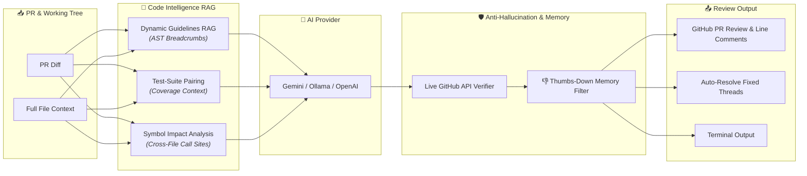

# 🤖 Poing AI

[](https://poingstudios.github.io/poing-ai/)
[](https://pypi.org/project/poing-ai/)
[](https://github.com/marketplace/actions/poing-ai)
[](https://github.com/poingstudios/poing-ai/actions/workflows/ci.yml)
[](LICENSE)

**Poing AI** is an enterprise-grade AI code reviewer, issue triager, and multi-platform dependency updater powered by Google Gemini, Ollama, and OpenAI-compatible models. Built with dedicated static-analysis analyzers for game engine plugins (**Godot Engine**, **Unity**, **Unreal Engine**) and multi-platform native code.

📖 **[Official Documentation](https://poingstudios.github.io/poing-ai/)** · 🚀 **[Quickstart](#-quickstart)** · 🏛️ **[Architecture](#-how-it-works)**

---

## 🏛️ How It Works



---

## 🚀 Quickstart

### Option 1: GitHub Action (Automated PR Reviews)

Create `.github/workflows/poing-ai.yml`:

```yaml
name: "Poing AI Review"

on:
  pull_request_target:
    types: [opened, ready_for_review]
  issue_comment:
    types: [created]

jobs:
  review:
    if: >
      (github.event_name == 'pull_request_target' && !github.event.pull_request.draft) ||
      (github.event_name == 'issue_comment' && github.event.issue.pull_request && (contains(github.event.comment.body, '/review') || contains(github.event.comment.body, '@poing-ai review')))
    runs-on: ubuntu-latest
    permissions:
      contents: read
      pull-requests: write
    steps:
      - name: 1. Checkout Code
        uses: actions/checkout@v7
        with:
          fetch-depth: 0

      - name: Checkout PR (for /review comment trigger)
        if: github.event_name == 'issue_comment'
        run: gh pr checkout "$PR_NUMBER"
        env:
          PR_NUMBER: ${{ github.event.issue.number }}
          GH_TOKEN: ${{ secrets.GITHUB_TOKEN }}

      - name: 2. Run Poing AI
        uses: poingstudios/poing-ai@v1
        with:
          gemini-api-key: ${{ secrets.GEMINI_API_KEY }}
```

*(Add a free `GEMINI_API_KEY` from [Google AI Studio](https://aistudio.google.com/) to your GitHub repository secrets).*

---

### Option 2: Local Terminal CLI

Install Poing AI via PyPI:

```bash
pip install --upgrade poing-ai
```

Run code reviews directly on your local git changes before pushing:

```bash
# Review uncommitted changes (uses free Gemini or local Ollama)
poing --local

# Automatically fix detected bugs & lint violations with Google Antigravity Agent
poing --local --fix --provider antigravity

# Automatically fix issues using local Ollama (100% offline)
poing --local --fix --provider ollama

# Review staged changes only
poing --local --staged
```

---

### 🤖 Option 3: 1-Click AI Setup Prompt

Click **Copy** below and paste it directly into **Cursor**, **ChatGPT**, **Claude**, or **Antigravity**:

```text
Please set up Poing AI in this repository:
1. Inspect this repository to detect the project type and game engine (Godot, Unity, Unreal, or multi-platform native).
2. Create `.github/workflows/poing-ai.yml` using `poingstudios/poing-ai@v1` with `pull_request_target` (opened, ready_for_review) and `issue_comment` (/review, /fix) triggers.
3. (Optional) Create `.github/poing.json` tailored to this project's architecture and guidelines directories.
4. Remind me to configure the `GEMINI_API_KEY` repository secret (free from https://aistudio.google.com/).
5. Install the local CLI via `pip install --upgrade poing-ai` and run `poing --local` to verify.
```

📖 *For full IDE skill files (`SKILL.md` / `.cursor/rules/`), see the [AI Agent Skills Guide](https://poingstudios.github.io/poing-ai/guides/ai-agent-skills/).*

---

## 💬 PR Commands

Interact with Poing AI inside GitHub Pull Requests:

| Command | Description |
|---|---|
| `/review` | Triggers a fresh, immediate code review |
| `/fix` | Triggers autonomous code repair: applies patches, runs tests, and pushes commits to the PR |
| `@poing-ai review` | Alternative mention to request a review |
| `@poing-ai fix` | Alternative mention to request an auto-fix |

---

## 🔍 Deep Dive & Advanced Architecture

<details>
<summary><b>🧠 1. Code Intelligence RAG Pipeline</b></summary>
<br>

Poing AI incorporates a 5-pillar context retrieval architecture:

- **Hierarchical AST Markdown Breadcrumbs**: Chunks guidelines while preserving structural breadcrumbs (e.g. `[AGENTS.md > GDScript Rules > Type Inference]`).
- **Dynamic Diff-Aware Querying**: Inspects modified file extensions, paths, and language tokens to retrieve only relevant rules.
- **Test-Suite Pairing**: Automatically discovers and provides matching unit test files to verify test coverage.
- **Cross-File Symbol Impact**: Scans repository files for external usages and callers of functions modified in the PR.
- **Full-File Ground Truth**: Passes the entire modified files to ensure the model never hallucinates missing imports or scope errors.
</details>

<details>
<summary><b>🎮 2. Game Engine & Ecosystem Analyzers</b></summary>
<br>

Poing AI includes native architectural rules for specialized ecosystems:

- **Godot Engine**: Enforces `:=` type inference, node lifecycle safety (`_ready` / `_physics_process`), signal conventions, and `internal/` folder encapsulation without `class_name`.
- **Unity**: Detects `null` comparison gotchas with `UnityEngine.Object`, GC allocations in `Update()`, and memory leaks with native textures/meshes.
- **Unreal Engine**: Enforces `UCLASS` / `UPROPERTY` garbage collection hygiene, `TArray` reallocations, and Smart Pointer conventions.
- **Generic / Multi-Platform**: Strict API parity validation across Android (Kotlin/JNI), iOS (Swift/Obj-C), C#, and C++.
</details>

<details>
<summary><b>🛡️ 3. Anti-Hallucination & Developer Feedback Loop</b></summary>
<br>

- **Live GitHub Release API Checking**: Verifies GitHub Action tags and package versions against live GitHub APIs in real-time before flagging them as invalid.
- **Thumbs-Down Memory Filter**: If a developer reacts with `👎` to a comment, Poing AI hashes and suppresses that finding across future PR reviews.
- **Automatic Thread Resolution**: Automatically resolves fixed review threads via GitHub GraphQL when the issue is corrected in a subsequent commit.
</details>

<details>
<summary><b>📦 4. Issue Triage & Multi-Platform Dependency Sync</b></summary>
<br>

- **Issue & PR Triage (`mode: triage`)**: Automatically categorizes issues, assigns labels (`bug`, `enhancement`, `ios`, `android`), assigns priority, and detects duplicates.
- **Upstream Dependency Automation (`mode: sync`)**: Checks Google Maven, Maven Central, SPM, Godot Releases, Unity UPM, and NuGet, updates manifests, and generates changelogs.
</details>

<details>
<summary><b>⚙️ 5. Repository Configuration (`.github/poing.json`)</b></summary>
<br>

Customize behavior per repository with a `.github/poing.json` file:

```json
{
  "provider": "gemini",
  "review": {
    "model": "gemini-3.8-flash",
    "strict_ground_truth": true,
    "rag": {
      "provider": "local",
      "guidelines_dirs": [".agents", "docs"]
    }
  },
  "triage": {
    "auto_assign_priority": true
  }
}
```
</details>

---

## 📖 Complete Documentation

For detailed configuration references, CLI flags, self-hosted webhooks, and AI provider setup guides:

👉 **[https://poingstudios.github.io/poing-ai/](https://poingstudios.github.io/poing-ai/)**

---

## 📜 License

Poing AI is open-source software licensed under the [Apache License 2.0](LICENSE).
